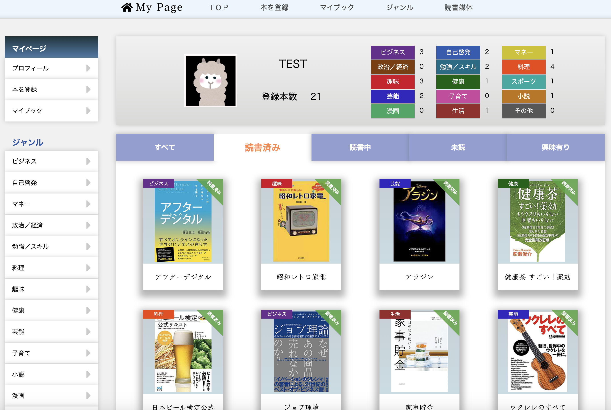
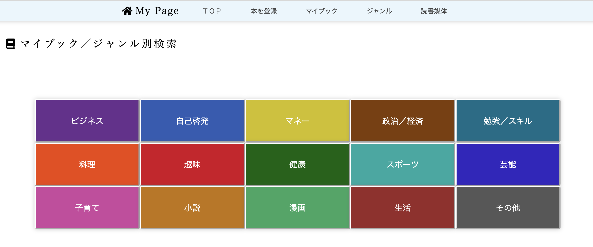
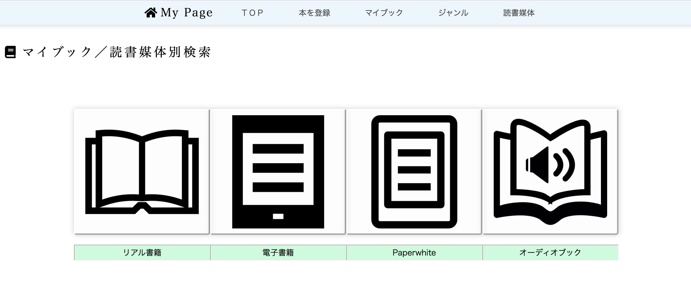
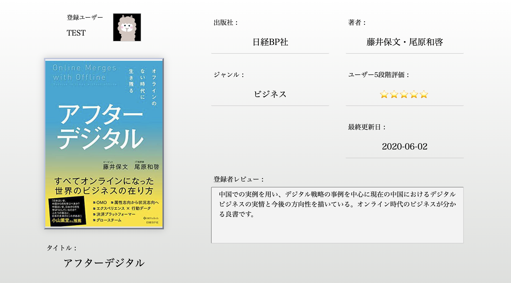

# Book Stock

# 概要
本を登録・管理するアプリです。
本が持つ様々な要素の視点から視覚的、直感的に一元管理することができます。

### URL
https://book-stock.herokuapp.com/

### テストアカウント
ログインページにテストアカウントをご用意しております。

# 機能一覧
### ユーザー管理
・ユーザー登録、編集機能
・ログイン、ログアウト機能
・プロフィール編集機能
### 本の登録
・本の登録、編集、削除機能
### 検索機能
・タイトル、出版社、著者のキーワード検索機能
・ジャンル別、本の5段階評価別、読書媒体別、読書ステータス別索機能
### ユーザー間交流
・自己紹介登録機能（プロフィール）
・本へのコメント投稿機能
・本の5段階評価／レビューの共有
### その他
・ページネーション
・フラッシュメッセージ
・ジャンル別登録状況確認リスト

# 使用技術一覧
### フロントエンド
・HTML (haml)
・CSS (sass)
・JavaScript (jQuery)

### サーバーサイド
・Ruby (2.5.1)
・Rails (5.0.7.2)

### ユーザー関連
・device

### 画像関連
・carrierwave

### DB
・MySQL(5.6.47)

### デプロイ
・heroku
・S3(画像保存)

# 制作背景
数多く所有する本の管理は煩雑になりがちであり、また従来の紙媒体の書籍の他にも様々な媒体で読書をするようになった今、「本の管理」に焦点を当て、手持ちの本を誰もが1つのアプリで視覚化、一元管理が出来ると便利であると思い開発しました。

# 特徴
### 本の視覚的管理
読者によって様々な要素を持つ本を視覚的に管理できます。読書済み、読書中、未読、興味ありの4つの項目で読書ステータスを登録が可能です。
また、ジャンル毎の登録数が一目で分かり、自分の読書傾向値も測れます。

### 複数の検索機能
検索フォームでのキーワード検索に加え、ジャンルや読書媒体、読書ステータスなどから本を検索する機能により、所有している本、アプリ内の本を様々な観点から探す事ができます。

### ユーザー間の交流
ユーザーの嗜好性などのプロフィールの公開が可能な他、本の評価やレビューの共有、コメント投稿によるユーザー間の交流などで新たな本との出会いも期待できます。

# ER図

# DB設計
## usersテーブル
|Column|Type|Options|
|------|----|-------|
|name|string|null: false|
|email|string|null: false|
|password|string|null: false|
|user_image|string|
|birthday|date|
|introduction|string|
### Association
- has_many :books
- has_many :comments

## booksテーブル
|Column|Type|Options|
|------|----|-------|
|title|string|null: false|
|image|string|
|author|string|
|publisher|string|
|status|integer|null: false|
|genre|integer|null: false|
|item|integer|
|memo|text|
|impression|text|
|evaluation|integer|
|buy_date|date|
|user_id|integer|null: false, foreign_key: true|
### Association
- belongs_to :user
- has_many :comments

## commentsテーブル
|Column|Type|Options|
|------|----|-------|
|text|text|null: false|
|user_id|integer|null: false, foreign_key: true|
|book_id|integer|null: false, foreign_key: true|
### Association
- belongs_to :user
- belongs_to :book

